

# Timeless Prototype's WarTime

Timeless Prototype's WarTime is a digitally-downloadable, 3D-print-it-yourself, strategic tabletop game.

This game provides many hours of re-playable enjoyment. You are likely to learn about risk/reward, closed economies, strategies, and timing. Just printing all those 3D pieces will test your patience and mettle, long before the first game can even be played. It's character-building/discovery. :)

Suitable for two or more players. Check your local laws for age restrictions on battle games (wars are violent). If I was to give this a safe PEGI rating it would be PEGI 18 (weapons, violence, pretend money) - but PEGI ratings are for computer games, not tabletop games. Check your local laws.

TL;DR: [Game Rules](wartime-rules.md)

## Origins

> [@TimelessP](https://github.com/TimelessP): "When I was young, my friends and I used to play a battle game using pen and paper. We would draw our islands, bases, airfields, and all the military units, such as infantry, aircraft, ships, tanks, turrets, etc. Then, with each turn, we would stand the pen up on say a tank, and declare that we are "moving" or "attacking", then slide the pen by touching only the top of the pen, and the ballpoint pen would be made to slide and draw a streak. Where the streak ended, that's where we would draw the unit, and cross out the old position of the unit. Or, if attacking, if the line so much as touches the target piece it was counted as a "hit"!
> 
> Many years later we could play such games on computers (and some of those really good ones are no longer supported).
> 
> This creation of mine, which I shall call "Timeless Prototype's WarTime", is a "hat tip" to those old days of mine, playing on pen and paper, but now with proper game pieces.
> 
> I really hope you all enjoy playing this game. Know that much thought (including golden ratios), effort (my 3D printer needs replacing!), and time (decades even) have gone into its creation.
> 
> If you really do want to show appreciation, please consider [buying me a coffee](https://www.buymeacoffee.com/timelessp). Thank you so much!"
> 
> 

## Print Instructions

This game is available as a [digital download](https://github.com/TimelessP/wartime), and you have to print the game pieces yourself (disclaimer: see [LICENCE](LICENSE.txt)).

The game pieces are designed to be printed on 3D printers. The game's pretend money can be printed on any 2D paper
printer. You will need to cut the pretend money out yourself.

All quantities below are per-player quantities. You might like to print the pieces so that each player has their own
colour. The game rules support two or more players. The quantities to print of each piece are as follows:

| Thumbnail                                                                                                                                                                        | Piece            | Print Quantity | Media Type |
|:---------------------------------------------------------------------------------------------------------------------------------------------------------------------------------|------------------|----------------|------------|
|                                           | pretend money    | 1              | 2D paper   |
|                                    | airfield         | 2              | 3D plastic |
| [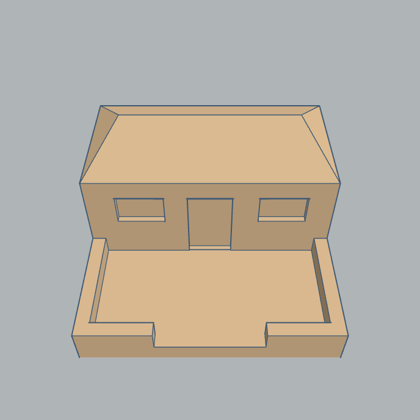](media/3d-prints/3dpiece-barracks.stl "barracks")                                   | barracks         | 2              | 3D plastic |
| [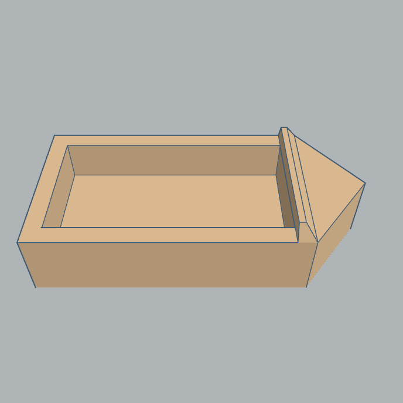](media/3d-prints/3dpiece-boat.stl "boat")                                                   | boat             | 2              | 3D plastic |
|                                | bulldozer        | 2              | 3D plastic |
| [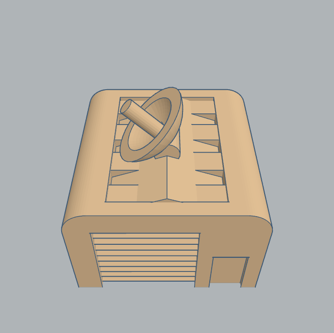](media/3d-prints/3dpiece-command-centre.stl "command centre")           | command centre   | 2              | 3D plastic |
|                                                            | d6               | 1              | 3D plastic |
| [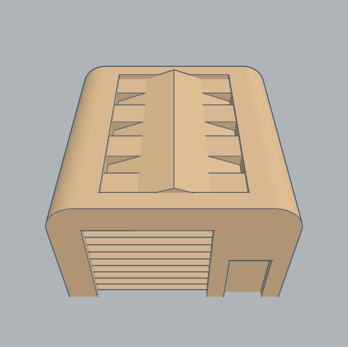](media/3d-prints/3dpiece-factory.stl "factory")                                       | factory          | 2              | 3D plastic |
| [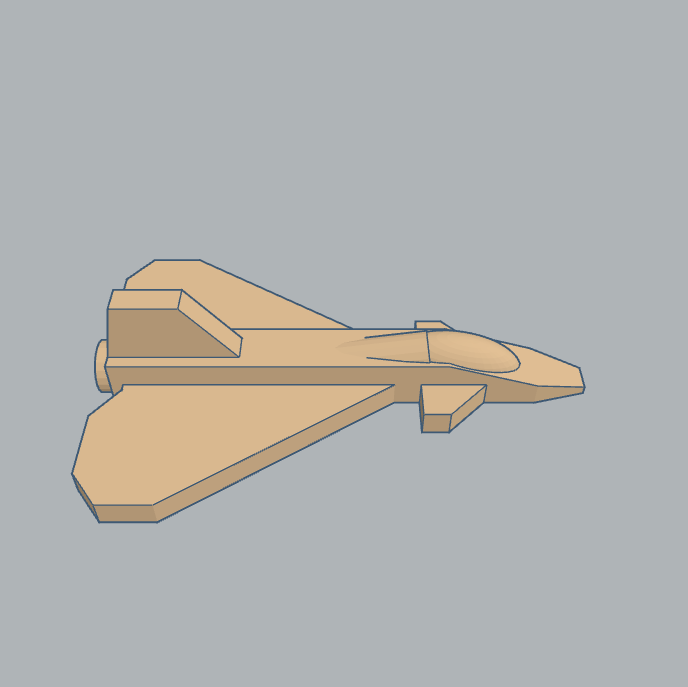](media/3d-prints/3dpiece-fighter-jet.stl "fighter jet")                       | fighter jet      | 2              | 3D plastic |
|                | fortification    | 8              | 3D plastic |
| [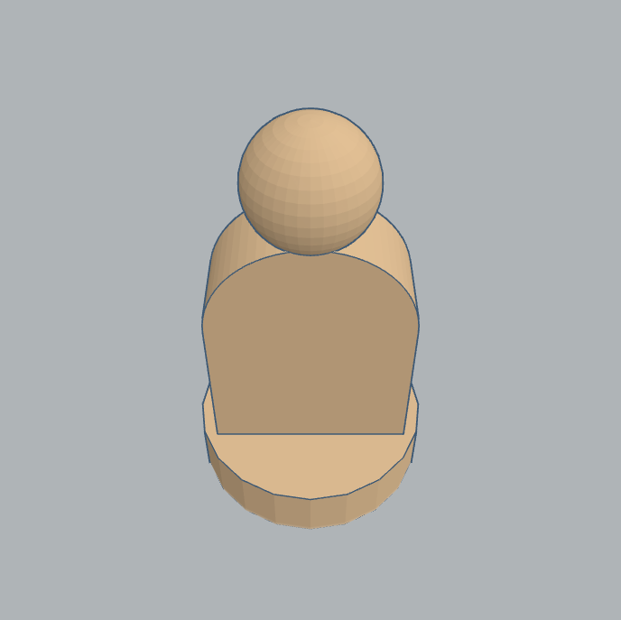](media/3d-prints/3dpiece-infantry.stl "infantry")                                   | infantry         | 9              | 3D plastic |
|        | measuring stick  | 1              | 3D plastic |
|        | missile battery  | 2              | 3D plastic |
| [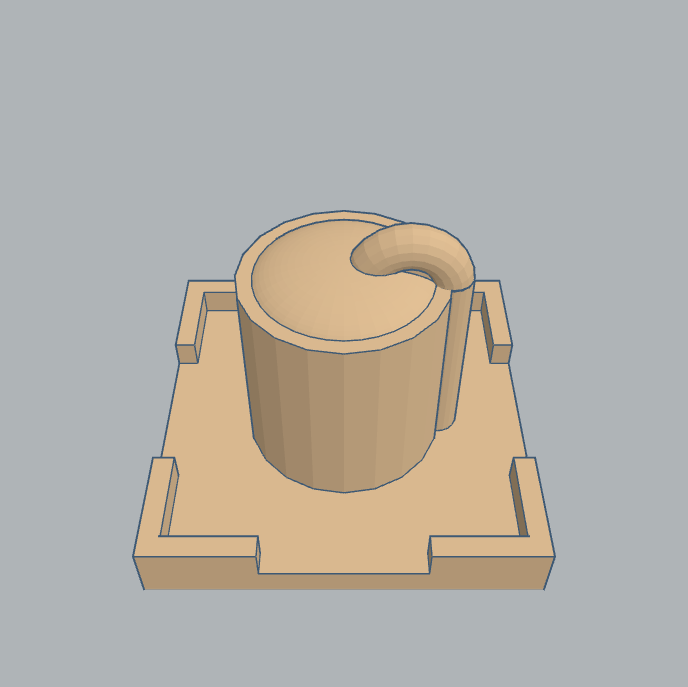](media/3d-prints/3dpiece-oil-storage.stl "oil storage")                       | oil storage      | 2              | 3D plastic |
| [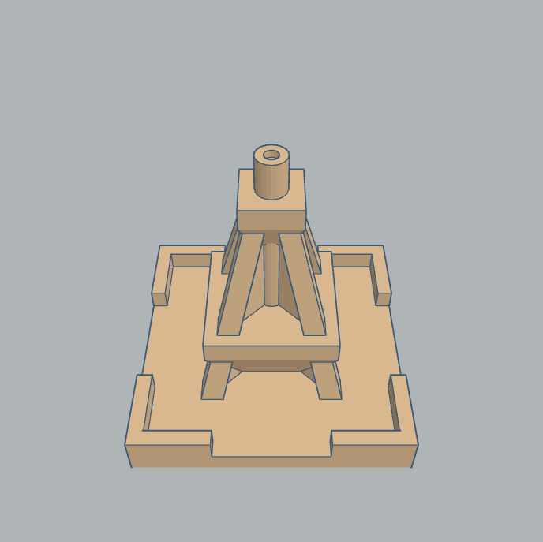](media/3d-prints/3dpiece-oil-well.stl "oil well")                                   | oil well         | 2              | 3D plastic |
|                       | plus disc        | 4              | 3D plastic |
| [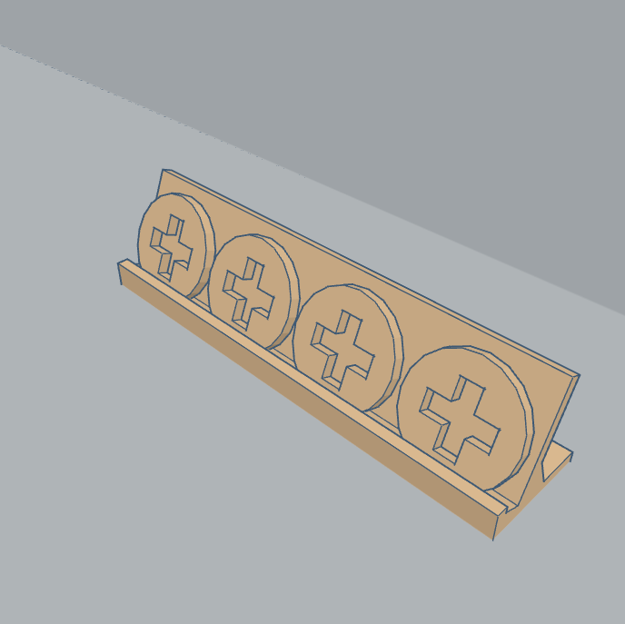](media/3d-prints/3dpiece-plus-disc-holder.stl "plus disc holder") | plus disc holder | 1              | 3D plastic |
| [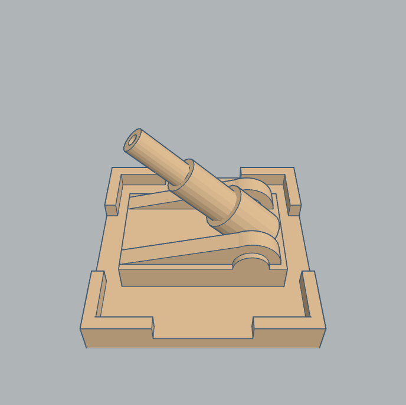](media/3d-prints/3dpiece-superweapon.stl "superweapon")                       | super weapon     | 1              | 3D plastic |
|                                                    | tank             | 2              | 3D plastic |
| [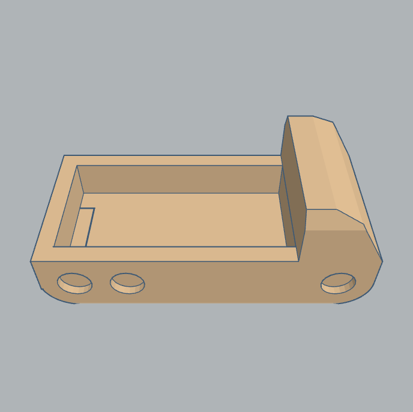](media/3d-prints/3dpiece-truck.stl "truck")                                               | truck            | 2              | 3D plastic |

Total pretend cash amount to print per player is `1000 + 500 * 3 + 100 * 5 = 3000` (i.e. one sheet of pretend money).

Total number of 3D-printed pieces per player is 49.

The number of pieces and limited cash supply is part of the game design.

Here's a YouTube video of the pieces I printed:

## Customise

The game pieces are designed using TinkerCAD. You can view or clone (for editing) the [original game pieces](https://www.tinkercad.com/things/agy86gBAnTb) that were designed by Timeless Prototype.

## Game Rules

The [game rules](wartime-rules.md) are available online. 

## Licence

Refer to the [LICENCE](LICENSE.txt) file for details.

## Open Source Licences

| Title                                                                                                                        | Licence Type      |
|:-----------------------------------------------------------------------------------------------------------------------------|:------------------|
| [Oswald font](https://fonts.google.com/specimen/Oswald?preview.text=1234567890&preview.text_type=custom&category=Sans+Serif) | Open Font Licence |
