# Timeless Prototype's WarTime - Game Rules

## Setting up a new game

Set aside an area of your table which will act as the "Bank". All pieces and cash are placed in the bank. Cash is common
to all players, but players will only have access to pieces belonging to the player's chosen piece colour.

Each player chooses a colour, and places one of each of the following:

- Command Centre
- Bulldozer next to the Command Centre
- Oil well
- Plus Disc Holder

The game is ready to play.

## Playing a turn

### Income from Oil Wells and Oil Storage units in play

At the start of each turn, if there's enough cash in the bank (giving change for higher denominations is allowed), the
bank gives 100 cash to the player for every Oil Well and/or Oil Storage piece the player has on the table.

### Piece selection and action

The player chooses a piece and states what action it's taking (see reference section below). Some actions require a d6
roll, measuring stick, or none of the above.

Note that an attack on a fortified building first destroys the fortification, and then another turn is needed to destroy
the building itself.

Fortified buildings cannot be captured until the fortification is destroyed - you cannot capture fortifications.

### Extra turns in the same turn

If the player chooses to spend a Plus Disc, they may take another turn within the same turn. The player must already
have the Plus Disc in their Plus Disc Holder in order to take another turn. A maximum of four Plus Discs can be spent in
this way if the player has that many already to spend.

### Reward

If any successful attacks (excluding fortifications, and not moves, nor captures, etc.) were made during the turn, only
one Plus Disc is given to the attacking player from the Bank, unless there are no more Plus Discs of the player's colour
remaining in the Bank.

### End of game or turn

A player exits the game if all their remaining pieces are sold, destroyed or captured.

The last player remaining in the game wins.

When the player's turn ends, then the next player's turn begins.

## Reference - general actions

### Moving a piece

- The player declares which piece is moving.
- 1x d6 is rolled for a distance.
- The measuring stick is used from the centre of the piece to measure (at any angle the player chooses) where the piece
  will be moved to.
- The piece is moved to the new location, at its centre.
- Repeat if the piece has the ability to move 2x d6 in the same turn.

Special case: 2x d6 is the distance of two d6 rolls in the case of the fighter jet's movement capability.

### Attacking with a piece

- The player declares which piece is attacking.
- 1x d6 is rolled for a distance.
- The measuring stick is used from any point on the piece to measure (at any angle the player chooses) where the piece
  will be attacking.
- If the measuring stick at the rolled distance touches any part of the target piece, or is within that range, the
  attack is successful.
- If the target unit is destroyed (fortifications do not count), and if a Plus Disc is available in the bank, it is
  awarded to the player.
- Repeat if the piece has the ability to attack 1x d6 twice in the same turn.

Special case: 2x d6 is the distance of two d6 rolls in the case of the missile battery's attack capability.

### Capturing with a piece

- The player declares which disembarked infantry piece is capturing which unfortified building.
- 1x d6 is rolled for a distance.
- The measuring stick is used from any point on the infantry piece to measure (at any angle the player chooses) where
  the infantry piece will be capturing.
- If the measuring stick at the rolled distance touches any part of the target building, or is within that range, the
  capture is successful.

### Embarking or disembarking a piece

Embarking or disembarking is a function of a boat or a truck. One or two infantry can be embarked or disembarked in the
same single action.

- The player declares which boat or truck is embarking or disembarking.
- 1x d6 is rolled for a distance.
- When embarking, any one or two infantry pieces within the range of the rolled distance can be embarked.
- When disembarking, any one or two infantry pieces can be disembarked from the boat or truck, at any point within the
  range of the rolled distance.

| Disembarked                                                                                 | 1x Embarked                                                                                               | 2x embarked                                                                                               |
|---------------------------------------------------------------------------------------------|-----------------------------------------------------------------------------------------------------------|-----------------------------------------------------------------------------------------------------------|
| 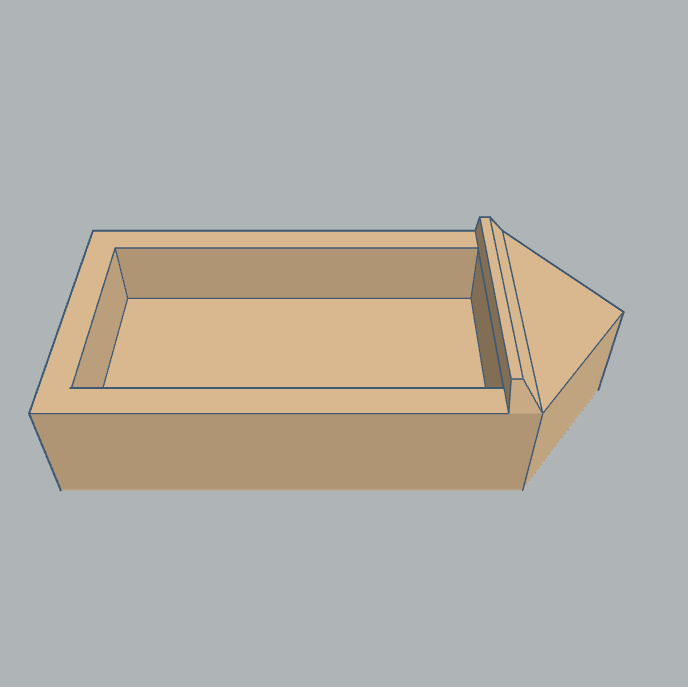 | 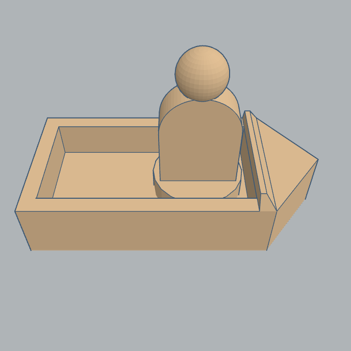 | 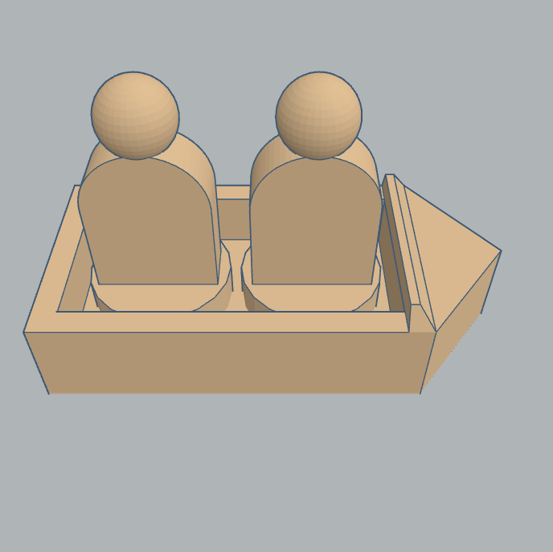 |

### Building or selling a piece

When building a piece using the bulldozer, the piece must be placed touching the bulldozer.

After a piece is sold (to the Bank only), it is removed from the table and placed back into the Bank, and is then
available for purchase again later.

### Price list

| Thumbnail                                                                                                                                                                  | Piece           | Creation Requires      | Buying Price | Selling Price |
|----------------------------------------------------------------------------------------------------------------------------------------------------------------------------|-----------------|------------------------|--------------|---------------|
| [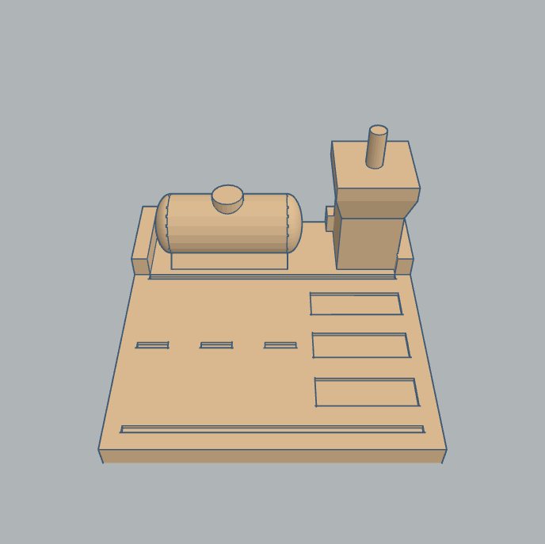](media/3d-prints/3dpiece-airfield.stl "airfield")                             | airfield        | bulldozer              | 100          | 100           |
| [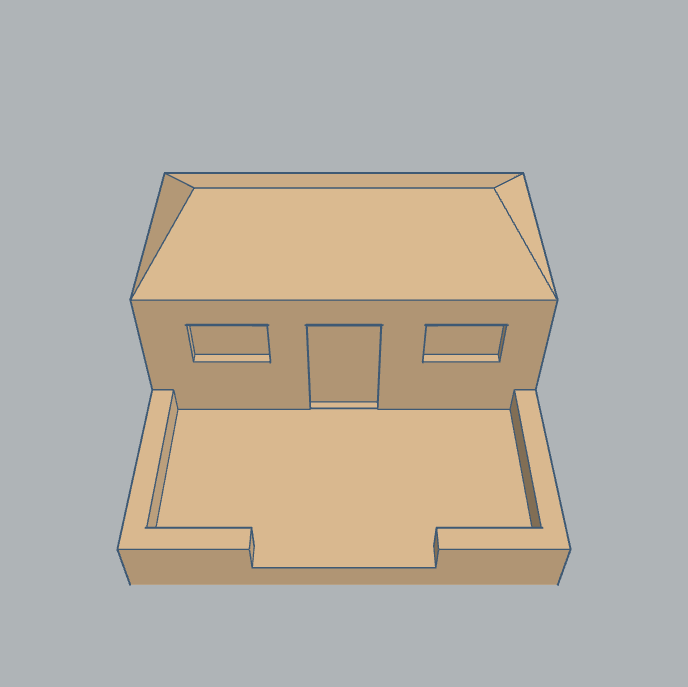](media/3d-prints/3dpiece-barracks.stl "barracks")                             | barracks        | bulldozer              | 100          | 100           |
|                                              | boat            | factory                | 100          | n/a           |
| [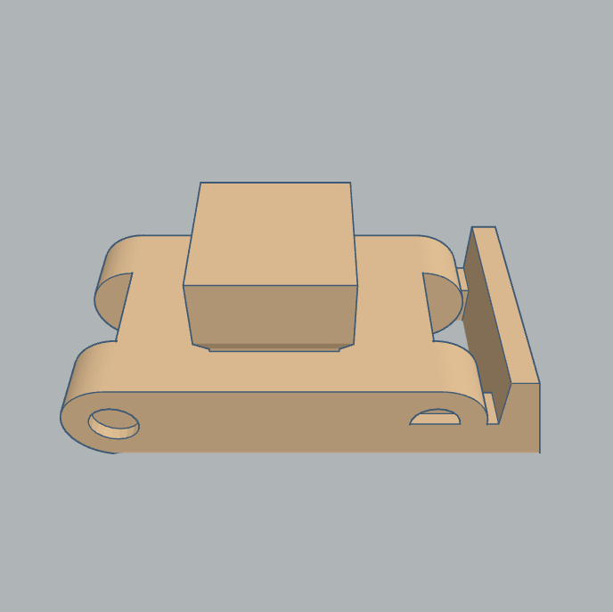](media/3d-prints/3dpiece-bulldozer.stl "bulldozer")                         | bulldozer       | command centre         | 200          | n/a           |
| [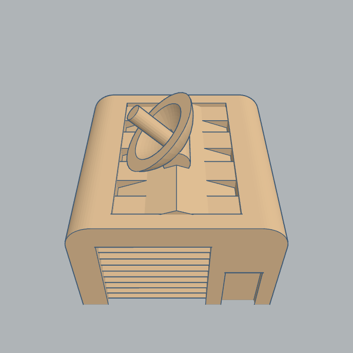](media/3d-prints/3dpiece-command-centre.stl "command centre")     | command centre  | bulldozer              | 500          | 100           |
| [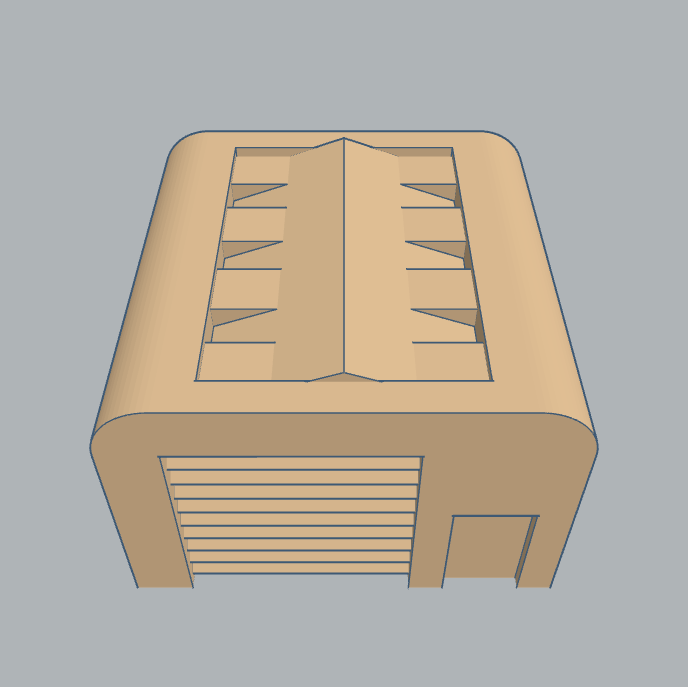](media/3d-prints/3dpiece-factory.stl "factory")                                 | factory         | bulldozer              | 100          | 100           |
| [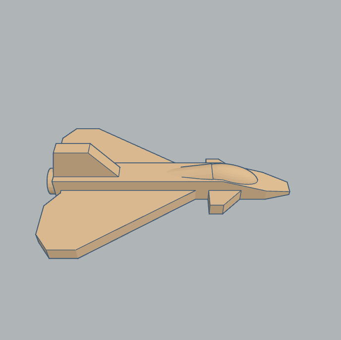](media/3d-prints/3dpiece-fighter-jet.stl "fighter jet")                 | fighter jet     | airfield               | 100          | n/a           |
| [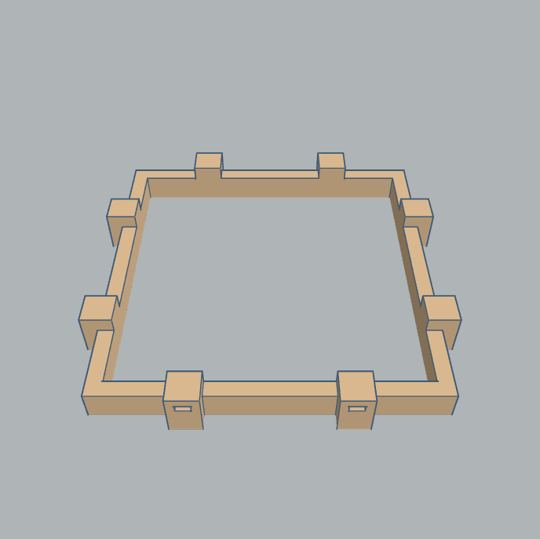](media/3d-prints/3dpiece-fortification.stl "fortification")         | fortification   | upgrade any building   | 100          | n/a           |
| [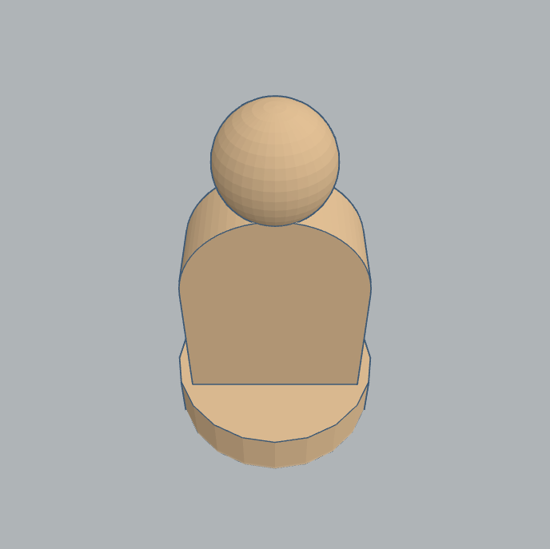](media/3d-prints/3dpiece-infantry.stl "infantry")                             | infantry (x2)   | barracks               | 100          | n/a           |
| [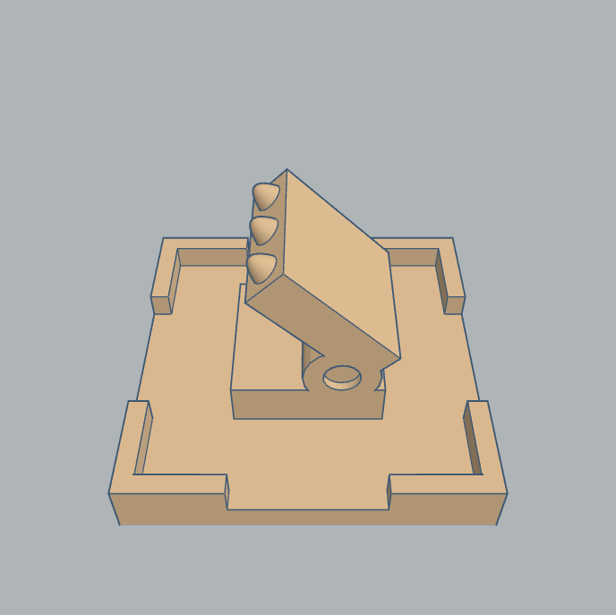](media/3d-prints/3dpiece-missile-battery.stl "missile battery") | missile battery | bulldozer              | 100          | 100           |
| [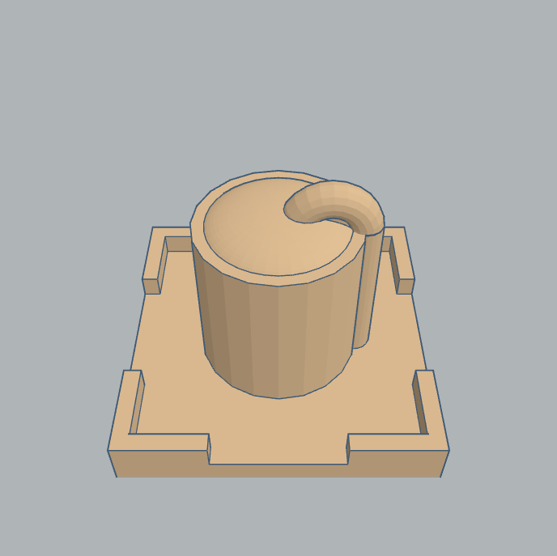](media/3d-prints/3dpiece-oil-storage.stl "oil storage")                 | oil storage     | bulldozer and oil well | 100          | 100           |
| [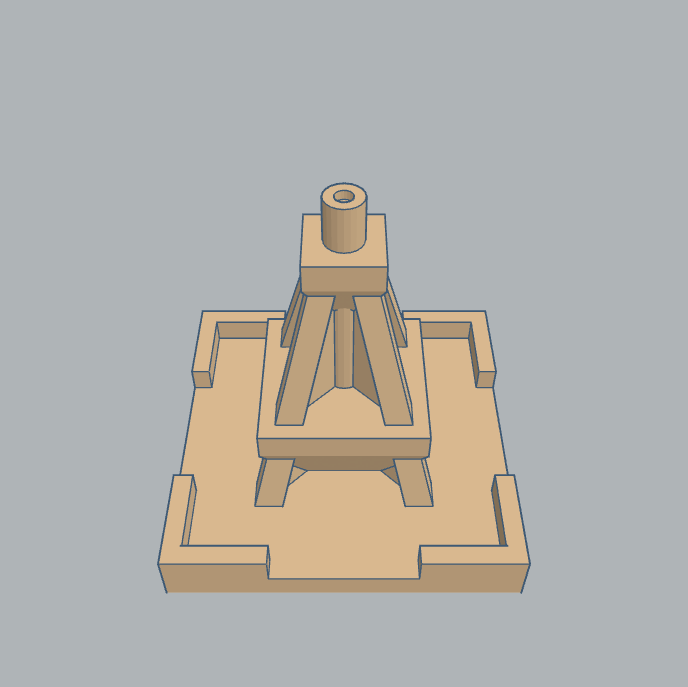](media/3d-prints/3dpiece-oil-well.stl "oil well")                             | oil well        | bulldozer              | 100          | 100           |
| [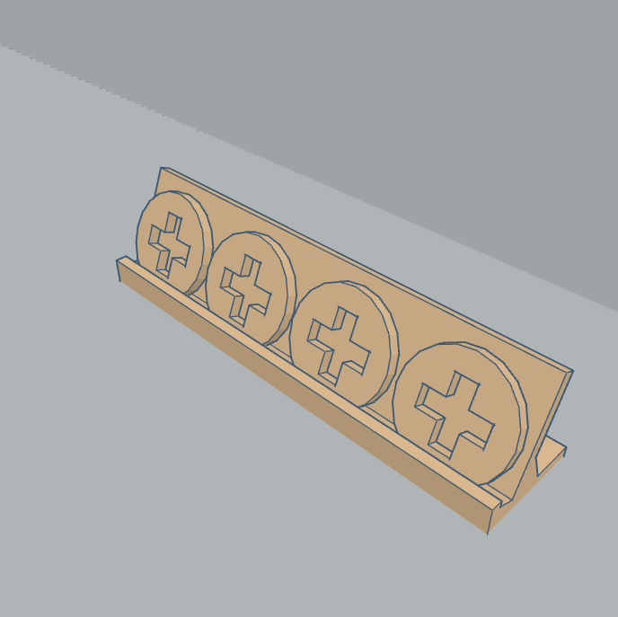](media/3d-prints/3dpiece-plus-disc.stl "plus disc")                | plus disc       | successful attack      | n/a          | 100           |
| [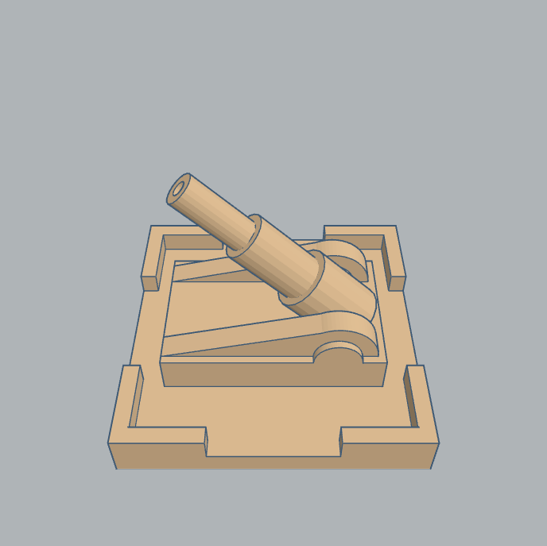](media/3d-prints/3dpiece-superweapon.stl "super weapon")               | super weapon    | bulldozer              | 1500         | 100           |
| [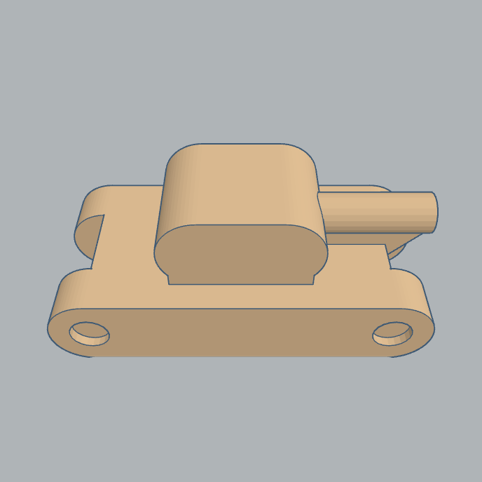](media/3d-prints/3dpiece-tank.stl "tank")                                             | tank            | factory                | 100          | n/a           |
| [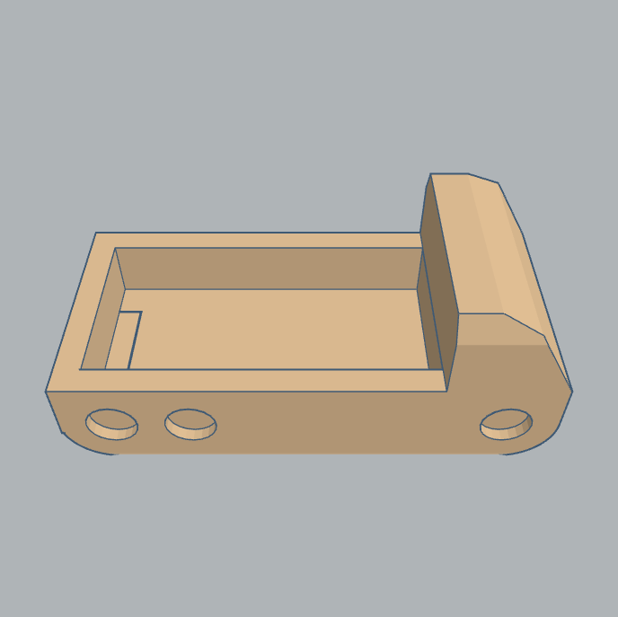](media/3d-prints/3dpiece-truck.stl "truck")                                         | truck           | factory                | 100          | n/a           |

## Reference - piece-specific actions

| Piece           | Move  | Attack                                                 | Special Actions                     | Description                                                                                                                                                                                                                                                                                     |
|-----------------|-------|--------------------------------------------------------|-------------------------------------|-------------------------------------------------------------------------------------------------------------------------------------------------------------------------------------------------------------------------------------------------------------------------------------------------|
| airfield        | n/a   | n/a                                                    | builds fighter jet, refuel, fortify | When a fighter jet has made an attack it is immediately returned to the airfield. If there is no empty airfield, the plane crashes and the piece is returned to the Bank. If an airfield is destroyed or sold whilst a fighter jet is on it, the fighter jet is lost too (destroyed, not sold). |
| barracks        | n/a   | n/a                                                    | produces 2x infantry in one turn    |                                                                                                                                                                                                                                                                                                 |
| boat            | 1x d6 | none, 1x d6 or 1x d6 twice                             | embark 1x or 2x, disembark 1x or 2x | Only embarked infantry can attack. Up to two embarked infantry can attack in the same turn for this vehicle. Disembarked (empty) vehicle cannot attack. Vehicle destruction results in occupants being lost too.                                                                                |
| bulldozer       | 1x d6 | n/a                                                    |                                     |                                                                                                                                                                                                                                                                                                 |
| command centre  | n/a   | n/a                                                    |                                     |                                                                                                                                                                                                                                                                                                 |
| factory         | n/a   | n/a                                                    |                                     |                                                                                                                                                                                                                                                                                                 |
| fighter jet     | 2x d6 | 1x d6 then refuel                                      | can move over land or sea           | After attacking, the fighter jet is immediately sent to an airfield for refuelling (see airfield).                                                                                                                                                                                              |
| fortification   | n/a   | 1x d6                                                  |                                     |                                                                                                                                                                                                                                                                                                 |
| infantry        | 1x d6 | 1x d6                                                  | capture unfortified building        | Can only capture if disembarked. Can only capture a building if its unfortified and an available replacement piece is available in the Bank for the player's colour.                                                                                                                            |
| missile battery | n/a   | 2x d6 ground-to-air only, 1x d6 ground-to-ground       |                                     |                                                                                                                                                                                                                                                                                                 |
| oil storage     | n/a   | n/a                                                    | earn 100 per turn                   | At the start of a player's turn, each Oil Storage piece earns the player 100 from the Bank, until no funds are available.                                                                                                                                                                       |
| oil well        | n/a   | n/a                                                    | earn 100 per turn                   | At the start of a player's turn, each Oil Well piece earns the player 100 from the Bank, until no funds are available.                                                                                                                                                                          |
| plus disc       | n/a   | n/a                                                    | extra turn, sell for 100            | A Plus Disc can be spent or sold during a turn, or earned at the end of a player's turn (not during).                                                                                                                                                                                           |
| super weapon    | n/a   | 1x (any range within 3x measuring sticks, always hits) | can only attack buildings           |                                                                                                                                                                                                                                                                                                 |
| tank            | 1x d6 | 1x d6                                                  |                                     | A tank can destroy a fortified building in a single 1x d6 attack.                                                                                                                                                                                                                               |
| truck           | 1x d6 | none, 1x d6 or 1x d6 twice                             | embark 1x or 2x, disembark 1x or 2x | Only embarked infantry can attack. Up to two embarked infantry can attack in the same turn for this vehicle. Disembarked (empty) vehicle cannot attack. Vehicle destruction results in occupants being lost too.                                                                                |
